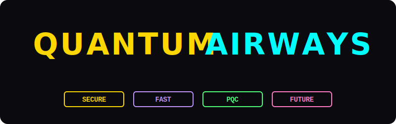

# Quantum Airways ✈️

A quantum-secure airline booking system simulating Post-Quantum Cryptography (PQC) to protect against future quantum threats.



## 🚀 Quick Start (Docker)

The application is containerized and ready to run.

```bash
# 1. Start the system
./run_system.sh

# 2. Access the application
# Frontend: http://localhost:3000
# Backend API: http://localhost:5000
```

> **Note:** The `run_system.sh` script is a wrapper for `docker-compose up --build`.

## 🏗️ Architecture

The system consists of three main components running in Docker containers:

1.  **Frontend (`frontend` service)**

    - **Tech:** Node.js, Vite, TypeScript, Web Components
    - **Port:** 3000
    - **Features:** Modern UI, Quantum-themed design, real-time booking interactions.

2.  **Backend (`backend` service)**

    - **Tech:** Python 3.10, Flask
    - **Port:** 5000
    - **Role:** REST API, PQC implementation, database interaction.

3.  **Database (`db` service)**
    - **Tech:** MariaDB 10.6
    - **Role:** Stores flights, bookings, and encrypted passenger data.

## 🛡️ The Quantum Trinity

This project implements three pillars of quantum security:

1.  **Kyber-512 (NIST FIPS 203)**

    - Lattice-based Key Encapsulation Mechanism (KEM).
    - Used for encrypting sensitive passenger data (Passport IDs) via shared secret derivation.

2.  **Dilithium3 (NIST FIPS 204)**

    - Lattice-based Digital Signature Algorithm.
    - Used for signing database records to prevent tampering and ensure integrity coverage.

3.  **Quantum Random Number Generator (QRNG)**
    - Simulates quantum behavior (Hadamard gates) to generate truly random entropy for booking references.

## 📂 Project Structure

```
├── frontend/               # Modern Node.js/Vite Frontend
│   ├── src/                # TypeScript source code
│   ├── public/             # Static assets
│   ├── Dockerfile          # Frontend container definition
│   └── vite.config.ts      # Vite configuration
│
├── api/                    # Legacy PHP API (Reference only)
├── backend/                # Python/Flask Backend Code
├── quantum_service/        # PQC Implementation logic
├── scripts/                # Helper scripts
│
├── server.py               # Main Flask Application Entry Point
├── init_db.py              # Database Initialization Script
├── entrypoint.sh           # Backend Container Entrypoint
├── run_system.sh           # Main startup script
├── docker-compose.yml      # Docker Orchestration
└── Dockerfile              # Backend Container Definition
```

## 🛠️ Development

### Frontend Development

The frontend supports Hot Module Replacement (HMR) inside the container.
Edits to `frontend/src` will reflect immediately at `http://localhost:3000`.

### Backend Development

The backend volume is mounted. Changes to `server.py` will trigger a reload (Flask debug mode is on).

## 📄 License

MIT


